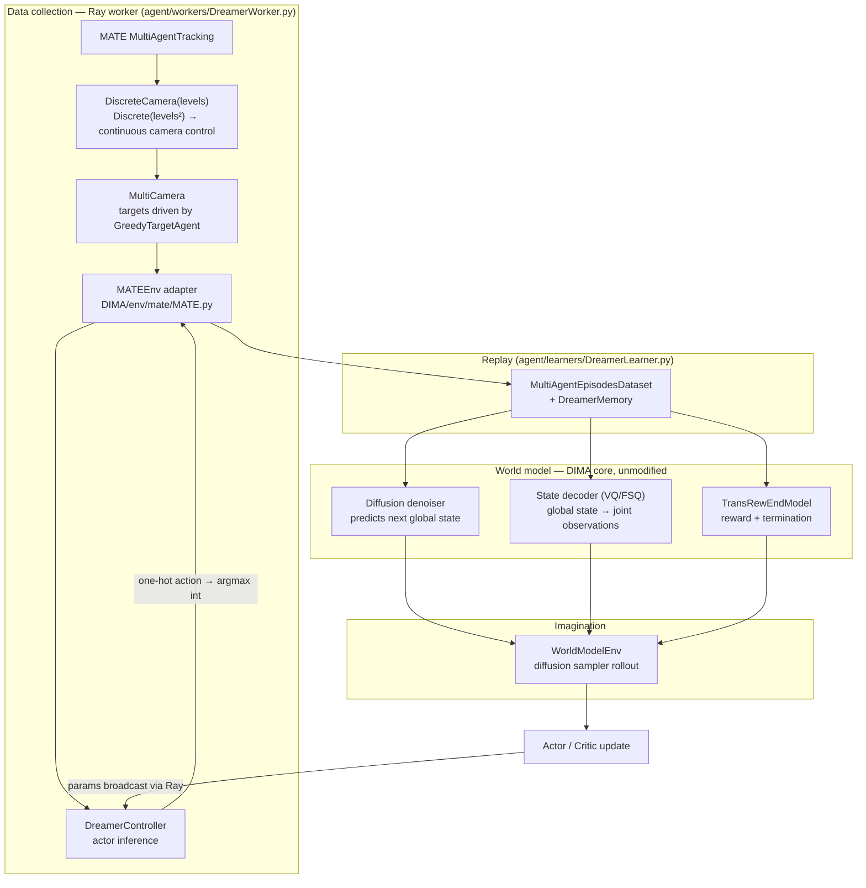

# DIMA × MATE — Diffusion-Inspired Multi-Agent World Modeling on the Multi-Agent Tracking Environment

This repository is a **research integration**: it runs the DIMA multi-agent
diffusion world-model algorithm on the MATE camera-tracking environment.

The integration deliberately does **one** thing — it swaps the environment.
The diffusion model, the world model, the tokenizer, the reward/termination
model and the actor-critic machinery of DIMA are used **unmodified**.

> **Status: prototype / experimental research code.**
> The pipeline has been verified to run end-to-end (see [Testing](#testing)),
> but **no benchmark results, learning curves, or performance claims are made
> here.** Nothing in this repository has been trained to convergence.

---

## Overview

### What is DIMA?

DIMA (*Diffusion-Inspired Multi-Agent world model*) is the reference
implementation released with the paper *"Revisiting Multi-Agent World Modeling
from a Diffusion-Inspired Perspective"* (as stated in the upstream
[`DIMA/README.md`](DIMA/README.md)). Instead of a recurrent latent world model,
it learns a **diffusion denoiser over global environment states**, decodes
per-agent observations from the global state with a vector-quantized state
decoder, predicts reward and termination with a separate model, and trains an
actor-critic inside the resulting imagined rollouts.

Upstream: <https://github.com/breez3young/DIMA>
Upstream DIMA ships environment wrappers for SMAC, SMACv2, PettingZoo/MPE,
Google Research Football and MAMuJoCo.

### What is MATE?

MATE (*Multi-Agent Tracking Environment*) is an asymmetric two-team environment:
a team of **cameras** tries to keep a team of **targets** under observation while
the targets transport cargo between warehouses. Cameras control rotation and
zoom; the environment reports a `coverage_rate` describing how many targets are
currently tracked.

Upstream: <https://github.com/XuehaiPan/mate>

### What this repository adds

| Component | Origin |
|---|---|
| `DIMA/agent/world_models/**` (denoiser, diffusion sampler, VQ/FSQ tokenizer, reward/end model, world-model env) | **DIMA upstream — unmodified** |
| `DIMA/networks/**` (actor, critic, MLPs) | **DIMA upstream — unmodified** |
| `DIMA/dataset.py`, `DIMA/episode.py`, `DIMA/agent/memory/**` | **DIMA upstream — unmodified** |
| `DIMA/env/{starcraft,smacv2,pettingzoo,football,mamujoco}/**` | **DIMA upstream — unmodified** |
| `mate/**` | **MATE upstream** — plus two pre-existing local compatibility edits, see [Compatibility](#compatibility) |
| `DIMA/env/mate/MATE.py` | **New** — the MATE↔DIMA adapter |
| `DIMA/configs/dreamer/mate/*.py` | **New** — the three DIMA config classes MATE needs |
| MATE branches in `DIMA/train.py`, `DIMA/environments.py`, `DIMA/configs/EnvConfigs.py`, `DIMA/agent/workers/DreamerWorker.py`, `DIMA/agent/learners/DreamerLearner.py`, `DIMA/agent/runners/DreamerRunner.py` | **New** — wiring only (see [Integration design](#integration-design)) |

---

## Architecture

The data flow below is the one actually implemented in this repository.



Entry point: [`DIMA/train.py`](DIMA/train.py) → `DreamerRunner`
([`DIMA/agent/runners/DreamerRunner.py`](DIMA/agent/runners/DreamerRunner.py)),
which owns both the training workers and the evaluation workers.

---

## Environment

The adapter controls the **camera team only**. Targets are played by MATE's
built-in `GreedyTargetAgent`, so from DIMA's point of view this is a
cooperative single-team multi-agent task.

Wrapper stack, built in `MATEEnv.__init__`:

```
mate.make_environment(config=<scenario>.yaml, max_episode_steps=N)
        └── mate.DiscreteCamera(levels=L)
                └── mate.MultiCamera(target_agent=GreedyTargetAgent())
                        └── MATEEnv          (this repository)
```

`mate.make_environment()` is used instead of `gym.make()` on purpose — see
[Compatibility](#compatibility).

### Observation

Each camera receives a flat `float64` vector; the adapter exposes it to DIMA as
`{agent_id: np.ndarray}` and DIMA casts to `float32`. The global state comes
from `env.unwrapped.state()` and is replicated to every agent as `shared_obs`,
which is what the diffusion model is trained on.

Dimensions are read from the environment at startup (`train.py: get_env_info`),
so they follow the scenario. Measured values for the scenarios shipped with
MATE:

| Scenario | cameras | targets | obs dim | global state dim |
|---|---|---|---|---|
| MATE-1v1-9 | 1 | 1 | 70 | 81 |
| MATE-2v2-9 | 2 | 2 | 82 | 106 |
| MATE-2v4-9 | 2 | 4 | 92 | 138 |
| MATE-4v2-9 | 4 | 2 | 96 | 124 |
| MATE-4v4-9 | 4 | 4 | 106 | 156 |
| MATE-4v8-9 | 4 | 8 | 126 | 220 |
| MATE-8v8-9 | 8 | 8 | 154 | 256 |
| MATE-4v8-0 | 4 | 8 | 90 | 193 |

### Action space

A raw MATE camera action is continuous — `Box([-rotation_step, -zooming_step],
[+rotation_step, +zooming_step])`, i.e. two dimensions.

DIMA's policy for this integration is discrete, so the adapter applies MATE's
own **`DiscreteCamera(levels=L)`** wrapper. `DiscreteCamera` is part of **MATE
upstream**, not of DIMA. It replaces each camera's `Box(2,)` with
`Discrete(L × L)`: the `L × L` actions form a regular grid over the normalized
`(rotation, zoom)` square, and the wrapper maps the chosen grid point back to a
continuous camera command before the base environment sees it.

The default used here is `levels=5` → **25 discrete actions per camera**
(`--mate_levels`, default `5`).

The controller emits one-hot vectors; `DreamerWorker` converts them with
`action.argmax().item()` before calling the adapter.

### Reward

MATE returns a single scalar reward shared by the whole camera team. The
adapter does **not** use it. Instead it uses MATE's `coverage_rate` metric,
reported in every camera's `info` dict, and scales it:

```python
reward = float(infos[0]['coverage_rate']) * reward_scale   # reward_scale = 10.0
```

This scaling is **a choice made for this integration**, not part of DIMA and
not part of MATE. The motivation is bounded support: `coverage_rate ∈ [0, 1]`,
so the scaled reward lands in `[0, 10]`, inside the `[-10, 10]` value range
declared by `critic_dist_config` in the learner config. The raw MATE camera
reward is unbounded in comparison (values from roughly `-198` to `+5` were
observed over a short random-policy rollout).

The same value is broadcast to every agent as `{i: [reward]}`.

### Episode termination

MATE ends an episode when all cargo has been delivered **or** when
`episode_step > max_episode_steps`. The scenario YAML files ship
`max_episode_steps: 10000`; the adapter overrides this via
`mate.make_environment(..., max_episode_steps=N)`, default **200**
(`--mate_episode_limit`). The scalar `done` is broadcast per agent as
`{i: bool}`.

`avail_actions` is always `None`: every camera action is legal, and DIMA only
allocates an available-action buffer for SMAC/SMACv2.

---

## Integration design

**Why an adapter is needed.** `DreamerWorker` expects `reset()` to return three
values (`obs`, `shared_obs`, `avail_actions`) and `step()` to return six, all
keyed per agent as `{agent_id: value}`. MATE's `MultiCamera` returns a single
observation array from `reset()` and a 4-tuple `(obs, reward, done, infos)` from
`step()`, with scalar reward and scalar `done`. `DIMA/env/mate/MATE.py`
translates between the two, in the same style as the existing
`DIMA/env/pettingzoo/mpe_env.py` wrapper.

**Isolation.** Everything MATE-specific lives in the adapter and in
`DIMA/configs/dreamer/mate/`. The changes inside DIMA's own modules are
`elif env_type == Env.MATE:` branches placed next to the existing per-environment
branches — no existing branch was altered, and no algorithm code was touched:

| File | Change |
|---|---|
| `DIMA/environments.py` | one enum member `MATE = "mate"` |
| `DIMA/configs/EnvConfigs.py` | `MATEConfig`; the five env backends moved to lazy imports inside `create_env()` so a missing third-party package (smac, supersuit, gfootball, …) no longer breaks unrelated environments |
| `DIMA/agent/workers/DreamerWorker.py` | MATE branches in `_check_handle`, `run()` reset, `run()` step, episode metric; new `check_coverage()` helper |
| `DIMA/agent/learners/DreamerLearner.py` | one `elif` building a `MamujocoEpisode` (same layout: shared global state, no available actions) |
| `DIMA/agent/runners/DreamerRunner.py` | two logging branches so the metric is labelled `coverage_rate` instead of falling through to "scores" |
| `DIMA/train.py` | `prepare_mate_configs()`, the `Env.MATE` branch, and the `--mate_levels` / `--mate_episode_limit` flags |

**Episode metric.** `DreamerWorker.check_coverage()` reports the mean
`coverage_rate` over the episode, mirroring how the Football wrapper reports
`check_score()`.

---

## Compatibility

These are the compatibility decisions this integration relies on. They are
recorded here because several of them are non-obvious.

**Gym API.** MATE 0.1.0 predates the Gym 0.26 step/reset API. Its `reset()`
returns `(camera_obs, target_obs)` and its `step()` returns four values with a
single `done` — there is no `truncated`. Under `gym.make()`, Gym 0.26 wraps the
environment in `PassiveEnvChecker`, which reads that 2-tuple as `(obs, info)`
and then fails an observation-space assertion. The adapter therefore calls
`mate.make_environment()` directly, which bypasses Gym's wrapper stack.

**`np_random` / seeding.** Gym 0.26 hands out a `numpy.random.Generator`, but
MATE still calls the legacy `RandomState` helper `randint` in
`mate/mate/agents/base.py`, `mate/mate/agents/mixture.py` and
`mate/mate/wrappers/single_team.py`. `Generator` is an immutable C type and
cannot be patched in place. `DIMA/env/mate/MATE.py` installs a shim that wraps
`gym.utils.seeding.np_random` and adds `randint`/`rand`/`randn` aliases,
delegating everything else. **No file under `mate/` was modified for this.**

**Pre-existing local edits under `mate/`.** Two lines differ from MATE upstream
(`mate/mate/entities.py` and `mate/mate/environment.py`, both
`np_random.randint` → `np_random.integers`). These predate this integration work
and are preserved as-is.

**Reward/end model must be `transformer`.** `DIMA/configs/dreamer/mate/MATEAgentConfig.py`
sets `rew_end_model_type = 'transformer'`. This is required, not a preference:
`WorldModelEnv.__init__` reads `rew_end_model.config.tokens_per_block` and later
uses `.transformer` plus KV caching, which only `TransRewEndModel` provides.
DIMA's own defaults (`DreamerConfig`, `MPEDreamerConfig`) say `'rnn'`, which
raises `AttributeError` as soon as actor-critic imagination starts. That
upstream inconsistency was left untouched; only the MATE config opts out.

**Device.** `MATELearnerConfig` sets
`DEVICE = 'cuda' if torch.cuda.is_available() else 'cpu'`, unlike the upstream
configs which hardcode `'cuda'`.

**Exploration epsilon.** `MATEControllerConfig` must keep `epsilon = 0.`:
`DreamerController.step()`'s epsilon branch samples from `avail_actions`, which
is `None` for MATE.

**`.gitignore` anchoring.** DIMA's `.gitignore` contains the standard Python
`ENV/` venv pattern. On case-insensitive filesystems that also matches this
project's own `DIMA/env/` package, which silently excludes the environment
wrappers including the MATE adapter. It is anchored to `/ENV/` in this
repository.

---

## Installation

The versions below are the ones this integration was **actually run with**, read
back from the working interpreter.

| Package | Version |
|---|---|
| Python | 3.10.20 |
| gym | 0.26.2 |
| numpy | 1.26.4 |
| torch | 2.13.0+cpu |
| ray | 2.56.1 |
| wandb | 0.28.1 |
| einops | 0.8.2 |
| scipy | 1.15.3 |
| pyyaml | 6.0.3 |
| tqdm | 4.70.0 |
| psutil | 7.2.2 |
| pyglet | 2.1.16 |
| mate | 0.1.0 (editable install of `mate/`) |
| termcolor, ipdb | installed (no `__version__` exported) |

> ⚠️ `DIMA/environment.yml` is the **upstream DIMA** environment file. It pins
> `python=3.10.15`, `gym==0.21.0` and `numpy==2.1.3`, which do **not** match the
> versions above. It has not been edited, but it will **not** reproduce this
> integration as-is. Treat the table above as the source of truth and
> `environment.yml` as upstream reference.

Install MATE as an editable package so `import mate` resolves to the copy in
this repository:

```bash
pip install -e ./mate
```

DIMA's other environment backends (SMAC, SMACv2, PettingZoo/MPE, Google
Research Football, MAMuJoCo) are **not** required to run MATE — their imports
are lazy. See [`DIMA/README.md`](DIMA/README.md) for upstream instructions if
you want them.

---

## Running

All commands are run from the `DIMA/` directory.

### Training

```bash
cd DIMA
python train.py --env mate --env_name MATE-4v8-9 --policy_class discrete \
                --n_workers 2 --mate_levels 5 --mate_episode_limit 200 \
                --mode disabled
```

Flags that matter here (all defined in `train.py: parse_args`):

| Flag | Default | Meaning |
|---|---|---|
| `--env` | `flatland` | must be `mate` |
| `--env_name` | `5_agents` | MATE scenario, e.g. `MATE-4v8-9` (resolves to `mate/mate/assets/<name>.yaml`) |
| `--policy_class` | *required* | `discrete` for MATE |
| `--mate_levels` | `5` | `DiscreteCamera` levels; action size is `levels²` |
| `--mate_episode_limit` | `200` | overrides the scenario's `max_episode_steps` |
| `--n_workers` | `2` | Ray rollout workers |
| `--seed` | `1` | seed offset, see [Reproducibility](#reproducibility) |
| `--steps` | `1e6` | environment-step budget |
| `--mode` | `disabled` | wandb mode: `disabled` / `offline` / `online` |
| `--use_tensorboard` | off | enable the TensorBoard logger |

### Evaluation

There is **no separate evaluation script**. Evaluation is built into the
training loop: `DreamerRunner.run()` calls `DreamerServer.evaluate()` roughly
every 1000 environment steps, using a pool of dedicated evaluation workers with
`temperature = 1.0`, and prints

```
Steps: <n>, Eval coverage rate: <x>, Eval_returns: <y>, Mean episode length <z>
```

`train.py` also accepts `--load_pretrained --load_path <ckpt>`; when the
checkpoint contains an `actor`, `DreamerLearner` runs `eval_ac_in_wm()` and
exits. This path was **not** exercised during integration testing.

### Note on warm-up

Training does not begin immediately. `DreamerLearner.step()` returns early
until the replay buffer holds `MIN_BUFFER_SIZE` (5000) steps, and actor-critic
training only starts once `train_count > 9`. With `--mate_episode_limit 200`
that is ~25 episodes before the world model starts learning, and longer before
the policy does.

---

## Project structure

```
.
├── DIMA/                                  DIMA framework (upstream + integration)
│   ├── train.py                           training entry point; MATE branch + flags
│   ├── environments.py                    Env enum (adds MATE)
│   ├── dataset.py, episode.py             replay dataset / episode dataclasses (upstream)
│   ├── environment.yml                    upstream conda env (see Installation caveat)
│   ├── agent/
│   │   ├── runners/DreamerRunner.py       train loop, Ray server, evaluation
│   │   ├── workers/DreamerWorker.py       Ray rollout actor; MATE branches
│   │   ├── controllers/DreamerController.py  actor inference (upstream)
│   │   ├── learners/DreamerLearner.py     world-model + actor-critic training
│   │   ├── memory/DreamerMemory.py        flat replay buffer (upstream)
│   │   └── world_models/                  ── DIMA core, untouched ──
│   │       ├── diffusion/                 denoiser, sampler, inner model
│   │       ├── vq.py, vector_quantize_pytorch/   state decoder
│   │       ├── rew_end_model.py           reward / termination models
│   │       └── world_model_env.py         imagination rollout
│   ├── configs/
│   │   ├── EnvConfigs.py                  env factories (lazy imports; MATEConfig)
│   │   └── dreamer/
│   │       ├── DreamerAgentConfig.py       diffusion / world-model hyperparameters
│   │       ├── mate/                       ── new: MATE configs ──
│   │       └── {mpe,football,mamujoco,smacv2}/   upstream configs
│   ├── env/
│   │   ├── mate/MATE.py                   ── new: the MATE adapter ──
│   │   └── {starcraft,smacv2,pettingzoo,football,mamujoco}/   upstream wrappers
│   └── networks/                          actor, critic, MLPs (upstream)
│
├── mate/                                  MATE environment (upstream)
│   ├── mate/environment.py                MultiAgentTracking core
│   ├── mate/wrappers/                     DiscreteCamera, MultiCamera, …
│   ├── mate/assets/*.yaml                 scenario definitions
│   ├── mate/agents/                       greedy / heuristic built-in agents
│   ├── LICENSE                            MIT
│   └── pyproject.toml, requirements.txt
│
├── .gitignore
└── README.md
```

---

## Testing

There is no automated test suite in this repository. The following checks were
run manually during integration and **passed**:

| Check | Result |
|---|---|
| `python -m py_compile` on all changed/added files | passed |
| Import of `environments`, `configs.EnvConfigs`, `agent.*`, `dataset`, `episode`, `env.mate.MATE`, MATE configs | passed |
| Adapter `reset()` / `step()` shapes and dict keys; `reward == coverage_rate * 10` | passed |
| Episode terminates at `max_episode_steps + 1` | passed |
| Short training run via `train.py` CLI (2 episodes) | passed |
| Longer run reaching world-model training (17 episodes, reduced thresholds): denoiser and actor weights both changed | passed |
| Evaluation rollouts inside the training loop | passed |

These were run ad hoc, not from a committed test script — re-running them means
reproducing the commands in [Running](#running).

---

## Reproducibility

**Seeding.** `train.py` uses `RANDOM_SEED = 23 + args.seed * 100` and seeds
`torch`, `torch.cuda`, `numpy` and `random`. The same value is passed to
`MATEConfig` and forwarded to `MATEEnv.seed()` → `env.seed()`, which seeds the
MATE environment, its entities and the built-in target agents.

Note that Ray rollout workers are separate processes and DIMA does not give each
worker a distinct seed, so rollout-level determinism across workers is not
guaranteed.

**Configuration.** Hyperparameters are plain Python, not YAML — see
`DIMA/configs/dreamer/DreamerAgentConfig.py` (diffusion, perceiver, sampler,
horizon) and `DIMA/configs/dreamer/mate/MATELearnerConfig.py` (learning rates,
batch sizes, buffer). `train.py` copies `agent/`, `configs/` and `networks/`
into each run directory, so every run keeps a snapshot of the code that produced
it.

**Hardware.** Everything documented here was run **CPU-only**
(`torch 2.13.0+cpu`, `torch.cuda.is_available() == False`). `MATELearnerConfig`
selects CUDA automatically when available, but the CUDA path was not exercised.
Diffusion world-model training on CPU is slow.

---

## License

This repository vendors two upstream projects that **do not share the same
licensing terms**. Read this section before redistributing.

| Component | Terms |
|---|---|
| [`LICENSE`](LICENSE) at the repository root | MIT — `Copyright (c) 2026 Nguyen Van Gia Bach`. Intended to cover the **integration work authored here**: `DIMA/env/mate/MATE.py`, `DIMA/configs/dreamer/mate/`, the MATE branches listed above, this README and the ignore rules. |
| [`mate/LICENSE`](mate/LICENSE) | MIT — `Copyright (c) 2022 Xuehai Pan`. MATE keeps its own license and copyright notice; the root MIT license does not replace it. |
| `DIMA/` | **No upstream LICENSE file.** <https://github.com/breez3young/DIMA> ships none. |

⚠️ **Unresolved:** because DIMA carries no license, no redistribution or reuse
rights are granted for it by default, and the root MIT license **cannot**
retroactively license DIMA's code. The MATE branches added inside DIMA's own
modules are derivative of DIMA and inherit that uncertainty.

If you intend to publish or redistribute this repository, resolve the DIMA
licensing question with its authors first.

## Acknowledgements

- DIMA — <https://github.com/breez3young/DIMA>
- MATE — <https://github.com/XuehaiPan/mate>

Please cite the upstream authors' own papers as directed by their repositories.
