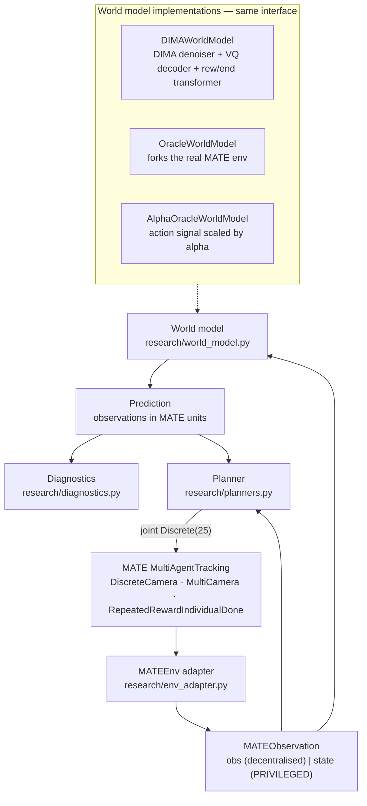

# DIMA × MATE — a research integration layer

Runs the **DIMA** multi-agent diffusion world model on the **MATE** camera-tracking
environment, and asks whether a good world model actually makes a better planner.

The design constraint is that neither upstream repository is rewritten:

```
        official DIMA          +          official MATE          +          research/
   (vendored, 2 lines patched)      (vendored, unmodified)          (all integration code)
```

`DIMA/` and `mate/` are byte-for-byte upstream at the commits recorded in
[`UPSTREAM.md`](UPSTREAM.md), except for two additive branches in DIMA documented
and justified in [`research/UPSTREAM_PATCHES.md`](research/UPSTREAM_PATCHES.md).
`bash research/scripts/verify_upstream.sh` proves it.

> **Status: research scaffolding, verified end-to-end.** The pipeline runs and the
> baselines reproduce MATE's own numbers. No trained world model here has been run
> to convergence and **no performance claim is made** for DIMA on MATE.

---

## The pipeline



The planner is swapped by name, never by editing the loop:

```bash
python -m research.evaluate --planner reactive_greedy
python -m research.evaluate --planner predictive_greedy --world-model dima --checkpoint <ckpt>
python -m research.evaluate --planner oracle           --world-model oracle
python -m research.evaluate --planner mypkg.mine:MyPlanner --world-model dima --checkpoint <ckpt>
```

---

## Install

```bash
conda create -n dima python=3.10 && conda activate dima
pip install -r requirements.txt
```

Nothing is installed as a package: `research/__init__.py` puts `DIMA/` and `mate/`
on `sys.path` (as roots — DIMA's modules import each other by top-level name) and
installs the two compatibility shims MATE needs on modern gym/NumPy. Always run
from the repository root.

## Quick start

```bash
# 0. does every layer work?
python -m research.smoke_test

# 1. collect MATE trajectories with a mix of MATE's own agents (not just random)
python -m research.collect --out datasets/mate4v2-mixed --episodes 300 --max-episode-steps 200

# 2. train DIMA's world model on them (DIMA's code, DIMA's schedule)
python -m research.train_wm --dataset datasets/mate4v2-mixed --run-dir runs/wm-4v2 \
    --passes 1 --horizon 5 --n-samples 2000 --wm-epochs 40 \
    --denoiser-steps-first-epoch 40 --remodel-steps 20

# 3. closed-loop evaluation + world-model diagnostics
python -m research.evaluate --baseline-matrix --episodes 20 \
    --checkpoint runs/wm-4v2/ckpt/model_final.pth --diagnostics

# tests
python -m unittest tests.test_research -v
RESEARCH_SLOW_TESTS=1 python -m unittest tests.test_research   # + the full pipeline
```

---

## What lives where

| Path | Role |
|---|---|
| `research/_compat.py` | `np.bool8` and gym-`np_random` shims; no-ops when not needed |
| `research/env_adapter.py` | MATE wrapper stack → the six numbers DIMA reads; `MATEObservation` |
| `research/views.py` | `SceneView` — the standardized scene a planner reasons about |
| `research/config.py` | DIMA config subclasses; dimensions read from the environment |
| `research/world_model.py` | `WorldModel` interface, `DIMAWorldModel`, oracle, α-oracle |
| `research/planners.py` | `Planner` interface, MATE-agent baselines, model-based planner, registry |
| `research/rollout.py` | the closed loop; conversion to DIMA's rollout dict |
| `research/diagnostics.py` | prediction error, action sensitivity, ranking, planner metrics |
| `research/logging_utils.py` | `[CATEGORY]` console + wandb + DIMA's TensorBoard + run manifest |
| `research/collect.py` `train_wm.py` `evaluate.py` `smoke_test.py` `mate_evaluate.py` | entry points |
| `tests/test_research.py` | `unittest`; neither upstream ships tests |

### What is reused rather than rebuilt

**From MATE** — the environment and every wrapper (`DiscreteCamera`, `MultiCamera`,
`RepeatedRewardIndividualDone`, optional `AuxiliaryCameraRewards`), the scenario
YAMLs, the observation layout API (`camera_observation_slices_of`), the agent
protocol (`CameraAgentBase`, `group_reset`/`group_step`), the rule-based agents
(`Random`/`Naive`/`Greedy`/`Heuristic` — these *are* the reactive baselines), the
entry-point registry (`mate.evaluate:load_entry`), the discrete↔continuous action
projection (`DiscreteCamera.reverse_action`), and the evaluation protocol.

**From DIMA** — every model (`Denoiser`, `DiffusionSampler`, `SimpleVQAutoEncoder`,
`TransRewEndModel`), `DreamerLearner` and its whole training schedule,
`MamujocoEpisode`, `MultiAgentEpisodesDataset`, `DreamerMemory`, `Batch`, the
config classes, checkpointing (`params`/`save`/`load_pretrained`), wandb logging
and `tb_logger.LOGGER`.

---

## Configuration

There is **one** source of truth per fact, and no new configuration format.

| Fact | Comes from |
|---|---|
| cameras, targets, obstacles, episode limit, reward type | `mate/mate/assets/MATE-4v2-9.yaml` — MATE's own scenario file |
| `IN_DIM`, `STATE_DIM`, `ACTION_SIZE`, `NUM_AGENTS`, `CONTINUOUS_ACTION` | read off the live environment by `research.config.apply_env_info`, which is `DIMA/train.py:82-88` |
| world-model hyperparameters | DIMA's `DreamerConfig` / `DreamerLearnerConfig`, subclassed not copied |
| run-time choices (planner, world model, seeds, episodes) | CLI flags, recorded in each run's `manifest.json` |

The only environment number chosen by hand is `--discrete-levels` (default 5).
MATE's camera action is continuous `Box(2,)` and DIMA's discrete path needs a
finite set, so the discretisation resolution is a genuine experiment parameter —
it cannot be detected. Its cost is measured, see below.

For `MATE-4v2-9` everything else is detected: 4 cameras, 2 targets, 9 obstacles,
`obs_dim=96`, `state_dim=124`, `|A|=25`.

---

## Local observation vs. privileged state

Brief section 9, enforced rather than only documented:

* `MATEObservation.obs` / `.obs_raw` — per-camera observations. Decentralised.
* `MATEObservation.state` / `.state_raw` — `MultiAgentTracking.state()`. **Privileged.**
* `PlanContext.privileged` is `None` unless the planner class sets
  `USES_PRIVILEGED_STATE = True`, so a decentralised planner cannot read the
  global state by accident.
* `SceneView` is a *team* view built only from the camera team's joint
  observation, which MATE's own agents already share by message passing.

**Known limitation.** DIMA's denoiser is a *global state* model: it conditions on
`shared_obs`, not on observations. So `DIMAWorldModel` reads the true global state
for its conditioning window at every closed-loop step, and `predictive_greedy` is
therefore **not** decentralised execution. This is inherent to putting DIMA's world
model in the loop, not an oversight. `evaluate.py` prints a `[WARN]` and every run
manifest records `uses_privileged_state: true`.

---

## Diagnostics

`--diagnostics` prints the block below and writes structured records to the run
directory (never large tensors to stdout). Metrics that cannot be computed print
`N/A` rather than disappearing.

```
WORLD MODEL DIAGNOSTICS
============================================================
Prediction error:            H, count, MAE, RMSE, ADE, FDE   (H = 1, 3, 5, 10)
Action sensitivity:          between / within / ratio        (ratio ≈ 1 ⇒ action-blind)
Per-camera sensitivity:      camera 0..N, and max/min ratio
Action ranking:              top-1, top-3, Spearman, Kendall, direction agreement, regret
Prediction validity:         finite, in-terrain, angle valid, sight range valid
============================================================
```

**Action sensitivity is defined against DIMA's actual sampler.** The denoiser is
stochastic — `DiffusionSampler.sample` starts from `randn · σ_max` and unmasks one
agent's action per denoising step — so a bare `‖pred(aᵢ) − pred(aⱼ)‖` would look
healthy even for a model that ignores actions. The metric therefore draws
`num_samples` predictions per candidate action from the *same* conditioning window
and separates **between**-action spread (of per-action means) from the **within**-action
sampling noise floor. The reported number is their **ratio**. See
`research/diagnostics.py:ActionSensitivityStats` for the full definition.

The five quantities are kept apart on purpose (brief section 35) — prediction
accuracy, action sensitivity, action ranking, planner performance, final coverage.
Nothing collapses them into one score, because "lower prediction error ⇒ better
planning" is a hypothesis to test, not an assumption to build in.

---

## Verified results

Everything below is reproducible from this repository; none of it is a claim about
DIMA's performance on MATE.

### The adapter reproduces MATE's own evaluation

`MATE-4v2-9`, 200-step episodes, 10 episodes, `GreedyTargetAgent` opponents.
Left column is MATE's official script; right column is this project's loop.

| Camera policy | `mate.evaluate` (continuous) | `research.evaluate` (discrete, levels=5) |
|---|---|---|
| `RandomCameraAgent` | 24.25 % coverage | 25.45 % |
| `GreedyCameraAgent` | 69.40 % coverage | 61.02 % |

Random matches. Greedy is lower because the adapter projects the greedy agent's
exact continuous `(rotation, zoom)` command onto a 5×5 grid via
`DiscreteCamera.reverse_action`. Raising the grid recovers part of it
(levels 9/15/21 → 64.0 / 63.0 / 63.1 %), and 10-episode noise is several points
wide, so the residual gap is consistent with discretisation. **This is a real
property of the discretised task DIMA has to operate in**, and it is why the
reactive-greedy baseline is run through the same adapter as everything else.

Reproduce:

```bash
python -m research.mate_evaluate --config mate/mate/assets/MATE-4v2-9.yaml \
    --camera-agent mate:GreedyCameraAgent --seed 0 --episodes 10 --no-render
python -m research.evaluate --planner reactive_greedy --episodes 10
```

### The observation decode is exact

`SceneView.coverage_estimate()`, computed from the camera joint observation, equals
MATE's internally-computed `info['coverage_rate']` to 9 decimal places at every
step (`tests/test_research.py:TestSceneView`). The rescale ↔ un-rescale round trip
is exact to ~1e-13.

### The planner interface works when the model is perfect

`ModelBasedGreedyPlanner` driven by `OracleWorldModel` beats `RandomPlanner` on
coverage (`tests/test_research.py:TestOraclePlannerBeatsRandom`). Same planner
class, same code path, only the world model swapped — which is what makes
"is it the model or the planner?" answerable.

---

## Known limitations

1. **Privileged conditioning.** See above — DIMA's world model reads the global state.
2. **Reward.** MATE's raw camera-team reward is used unchanged. It is sparse (zero
   on most steps) and unbounded below, well outside the `[-10, 10]` support DIMA's
   critic config assumes. Reward shaping is available through MATE's own
   `AuxiliaryCameraRewards` (`--reward-coefficients '{"coverage_rate": 1.0}'`) but
   is **off** by default, because turning coverage into the reward changes the task.
3. **Reward-head context.** `DIMAWorldModel` builds a fresh transformer KV cache per
   `predict()` call, because candidate-action search would otherwise pollute a
   shared one. Predicted reward is therefore conditioned on the current step only.
   It is reported as a diagnostic and is not the planner's default utility.
4. **The oracle is one sample.** MATE's targets and its obstacle-transmittance checks
   are stochastic and a fork advances its own RNG, so `OracleWorldModel` returns one
   sample of the real dynamics, not the branch the live episode will take.
5. **Action ranking needs a forkable state.** `compute_action_ranking` compares a
   model against the oracle at a live state; it cannot be evaluated from a logged
   transition, and prints `N/A` there.
6. **Search is coordinate descent.** `ModelBasedGreedyPlanner` does one sweep of
   `C × |A|` queries rather than searching all `|A|^C = 390 625` joint actions.
7. **`mate.evaluate --camera-discrete-levels` is broken upstream** for rule-based
   camera agents (they emit continuous actions that `DiscreteCamera.action` rejects).
   Unrelated to this project; noted because it blocks the obvious cross-check.
8. **CPU is the tested path.** The training numbers here come from a CPU run with a
   deliberately shortened schedule.

---

## Not implemented, on purpose

Brief section 34: destination prediction, uncertainty-aware planning, MPC, auction,
RL coordination, Hungarian assignment, a new diffusion architecture, a new
tokenizer. The first objective is a correct, debuggable loop. `PLANNER_REGISTRY`
and the entry-point form of `--planner` are where those go when their turn comes;
no other file needs to change.
