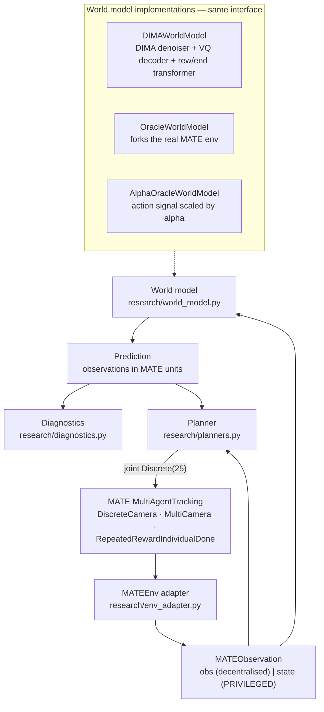

# DIMA × MATE — a research integration layer

Runs the **DIMA** multi-agent diffusion world model on the **MATE** camera-tracking
environment, and asks whether a good world model actually makes a better planner.

The design constraint is that neither upstream repository is rewritten:

```
        official DIMA          +          official MATE          +          research/
   (vendored, 2 lines patched)      (vendored, unmodified)          (all integration code)
```

`DIMA/` and `mate/` are byte-for-byte upstream at the commits recorded in
[`UPSTREAM.md`](UPSTREAM.md), except for two additive branches in DIMA documented
and justified in [`research/UPSTREAM_PATCHES.md`](research/UPSTREAM_PATCHES.md).
`bash research/scripts/verify_upstream.sh` proves it.

> **Status: research scaffolding, verified end-to-end.** The pipeline runs and the
> baselines reproduce MATE's own numbers. No trained world model here has been run
> to convergence and **no performance claim is made** for DIMA on MATE.

---

## The pipeline



The planner is swapped by name, never by editing the loop:

```bash
python -m research.evaluate --planner reactive_greedy
python -m research.evaluate --planner predictive_greedy --world-model dima --checkpoint <ckpt>
python -m research.evaluate --planner oracle           --world-model oracle
python -m research.evaluate --planner mypkg.mine:MyPlanner --world-model dima --checkpoint <ckpt>
```

---

## Install

```bash
conda create -n dima python=3.10 && conda activate dima
pip install -r requirements.txt
```

Nothing is installed as a package: `research/__init__.py` puts `DIMA/` and `mate/`
on `sys.path` (as roots — DIMA's modules import each other by top-level name) and
installs the two compatibility shims MATE needs on modern gym/NumPy. Always run
from the repository root.

## Quick start

```bash
# 0. does every layer work?
python -m research.smoke_test

# 1. collect MATE trajectories with a mix of MATE's own agents (not just random)
python -m research.collect --out datasets/mate4v2-mixed --episodes 300 --max-episode-steps 200

# 2. train DIMA's world model on them (DIMA's code, DIMA's schedule)
python -m research.train_wm --dataset datasets/mate4v2-mixed --run-dir runs/wm-4v2 \
    --passes 1 --horizon 5 --n-samples 2000 --wm-epochs 40 \
    --denoiser-steps-first-epoch 40 --remodel-steps 20

# 3. closed-loop evaluation + world-model diagnostics
python -m research.evaluate --baseline-matrix --episodes 20 \
    --checkpoint runs/wm-4v2/ckpt/model_final.pth --diagnostics

# tests
python -m unittest tests.test_research -v
RESEARCH_SLOW_TESTS=1 python -m unittest tests.test_research   # + the full pipeline
```

---

## Running on a GPU server

The laptop path above exists to prove the pipeline; real training belongs on a
GPU. Three things are set up for that, and one of them matters a lot.

### `configure_torch` runs before any DIMA module is built

`train_wm.py`, `evaluate.py` and `smoke_test.py` all call
`research.config.configure_torch(device, ...)`, which:

* **turns autograd anomaly detection off.** DIMA enables
  `torch.autograd.set_detect_anomaly(True)` globally — in `train.py` *and* in
  `DreamerLearner.__init__:83`. It records a traceback for every op in the graph
  and re-runs the backward pass hunting NaNs, which costs a large multiple of
  normal training time and holds extra memory. It is re-applied *after* the
  learner is constructed, because the constructor turns it back on. Restore it
  with `--detect-anomaly` only to chase an actual NaN.
* **enables TF32** (`matmul.allow_tf32`, `cudnn.allow_tf32`,
  `set_float32_matmul_precision('high')`) and **`cudnn.benchmark`**. The denoiser
  is matmul-bound and shapes are fixed after the first batch, so this is the
  largest free speedup available.
* **seeds** torch / numpy / random / CUDA together and records what it applied in
  the run manifest.

The GPU name, compute capability, memory and the flags actually applied are
printed as an `[WM]` line and stored in `manifest.json`. On CPU it prints a
`[WARN]` saying the path is for testing, not for training.

### Watch the metrics that matter, not the loss

Falling denoising loss does not mean the model is learning anything a planner can
use — it can fall while the model settles into an action-*independent* prior,
which is exactly what happened in the CPU run below. `train_wm.py` therefore
holds out episodes and validates on them:

```bash
python -m research.train_wm --dataset datasets/mate4v2-mixed --run-dir runs/wm-gpu \
    --passes 20 --horizon 5 \
    --val-episodes 20 --eval-every 1 --sensitivity-samples 8
```

```
[WM-DIAG] ade_h1=610.2413  mae_h1=137.3911  sensitivity_ratio=0.9971
[WARN] action sensitivity ratio 0.997 < 1.0 -- changing the action still moves the
       prediction less than re-sampling it does, so no planner can use this model yet.
[WM-DIAG] ade_h1=484.7062↓  mae_h1=136.0159↓  sensitivity_ratio=1.0273↑
```

Arrows show the direction of the last step, so a stalled or oscillating run is
visible in the console. The two numbers to watch:

| metric | wanted | meaning |
|---|---|---|
| `sighting_recall_h1` | ↑ | fraction of truly-sighted targets the prediction also sights — **read this first** |
| `ade_h1` | ↓ | displacement error of predicted target positions, over targets *both* views sight |
| `sensitivity_ratio` | ↑, and **above 1.0** | action effect vs. diffusion sampling noise; below 1.0 no planner can use the model |

A `[WARN]` fires on every validation where the ratio is still below 1.0.

**Why `sighting_recall` comes first.** A camera observation encodes an unsighted
target as a zeroed block, so `SceneView` reads its position as the origin. A model
that never predicts a target as sighted therefore "predicts" every target at
`(0, 0)`, and a naive displacement error collapses to the mean distance of the
true targets from the origin — a number that depends only on the environment.
That is not hypothetical: once the validation seeding was fixed so every pass
scored the same states, `ade_h1` came out at *exactly* 803.7159 on five
consecutive passes while `mae_h1` and the sensitivity ratio both moved. ADE and
FDE are now computed only over targets both views sight, and are `N/A` when
recall is zero.

### Everything is recorded, in three places

* `<run>/wm_validation.jsonl` — the held-out metrics above, per pass.
* `<run>/dima_scalars.jsonl` — **every scalar DIMA itself logs**, teed from
  `tb_logger.LOGGER` without touching DIMA: `denoiser/train/loss_denoising`,
  `state_decoder/train/vq/rec_loss`, `rew_end_model/train/loss_total`, and 26
  more. Both files are strict JSON (NaN and Inf are written as `null`).
* wandb and TensorBoard, via DIMA's own loggers — `--wandb-mode online`,
  `--tensorboard`.

### A preempted run still leaves a model

`--max-hours H` stops after the current episode once the wall-clock budget is
gone, then finishes the pass, validates, and writes `ckpt/model_final.pth`
normally. `stopped_early: true` goes into the manifest. `--save-every N` writes
`model_passNNN.pth` along the way; `ckpt/config.json` is written *before* the
first save, so even a killed run leaves loadable checkpoints.

### Checkpoints are self-describing

`ckpt/config.json` is written next to every checkpoint, before the first save, so
a run that dies mid-way still leaves loadable checkpoints. `DIMAWorldModel` reads
it automatically. This matters because `horizon` sizes `TransRewEndModel`'s
positional embedding, masks and head slicers: a model trained at `--horizon 5`
cannot be loaded at the default 15, and without the sidecar the failure is a wall
of `size mismatch` lines that never mentions horizons.

---

## What lives where

| Path | Role |
|---|---|
| `research/_compat.py` | `np.bool8` and gym-`np_random` shims; no-ops when not needed |
| `research/env_adapter.py` | MATE wrapper stack → the six numbers DIMA reads; `MATEObservation` |
| `research/views.py` | `SceneView` — the standardized scene a planner reasons about |
| `research/config.py` | DIMA config subclasses; dimensions read from the environment |
| `research/world_model.py` | `WorldModel` interface, `DIMAWorldModel`, oracle, α-oracle |
| `research/planners.py` | `Planner` interface, MATE-agent baselines, model-based planner, registry |
| `research/rollout.py` | the closed loop; conversion to DIMA's rollout dict |
| `research/diagnostics.py` | prediction error, action sensitivity, ranking, planner metrics |
| `research/logging_utils.py` | `[CATEGORY]` console + wandb + DIMA's TensorBoard + run manifest |
| `research/collect.py` `train_wm.py` `evaluate.py` `smoke_test.py` `mate_evaluate.py` | entry points |
| `tests/test_research.py` | `unittest`; neither upstream ships tests |

### What is reused rather than rebuilt

**From MATE** — the environment and every wrapper (`DiscreteCamera`, `MultiCamera`,
`RepeatedRewardIndividualDone`, optional `AuxiliaryCameraRewards`), the scenario
YAMLs, the observation layout API (`camera_observation_slices_of`), the agent
protocol (`CameraAgentBase`, `group_reset`/`group_step`), the rule-based agents
(`Random`/`Naive`/`Greedy`/`Heuristic` — these *are* the reactive baselines), the
entry-point registry (`mate.evaluate:load_entry`), the discrete↔continuous action
projection (`DiscreteCamera.reverse_action`), and the evaluation protocol.

**From DIMA** — every model (`Denoiser`, `DiffusionSampler`, `SimpleVQAutoEncoder`,
`TransRewEndModel`), `DreamerLearner` and its whole training schedule,
`MamujocoEpisode`, `MultiAgentEpisodesDataset`, `DreamerMemory`, `Batch`, the
config classes, checkpointing (`params`/`save`/`load_pretrained`), wandb logging
and `tb_logger.LOGGER`.

---

## Configuration

There is **one** source of truth per fact, and no new configuration format.

| Fact | Comes from |
|---|---|
| cameras, targets, obstacles, episode limit, reward type | `mate/mate/assets/MATE-4v2-9.yaml` — MATE's own scenario file |
| `IN_DIM`, `STATE_DIM`, `ACTION_SIZE`, `NUM_AGENTS`, `CONTINUOUS_ACTION` | read off the live environment by `research.config.apply_env_info`, which is `DIMA/train.py:82-88` |
| world-model hyperparameters | DIMA's `DreamerConfig` / `DreamerLearnerConfig`, subclassed not copied |
| run-time choices (planner, world model, seeds, episodes) | CLI flags, recorded in each run's `manifest.json` |

The only environment number chosen by hand is `--discrete-levels` (default 5).
MATE's camera action is continuous `Box(2,)` and DIMA's discrete path needs a
finite set, so the discretisation resolution is a genuine experiment parameter —
it cannot be detected. Its cost is measured, see below.

For `MATE-4v2-9` everything else is detected: 4 cameras, 2 targets, 9 obstacles,
`obs_dim=96`, `state_dim=124`, `|A|=25`.

---

## Local observation vs. privileged state

Brief section 9, enforced rather than only documented:

* `MATEObservation.obs` / `.obs_raw` — per-camera observations. Decentralised.
* `MATEObservation.state` / `.state_raw` — `MultiAgentTracking.state()`. **Privileged.**
* `PlanContext.privileged` is `None` unless the planner class sets
  `USES_PRIVILEGED_STATE = True`, so a decentralised planner cannot read the
  global state by accident.
* `SceneView` is a *team* view built only from the camera team's joint
  observation, which MATE's own agents already share by message passing.

**Known limitation.** DIMA's denoiser is a *global state* model: it conditions on
`shared_obs`, not on observations. So `DIMAWorldModel` reads the true global state
for its conditioning window at every closed-loop step, and `predictive_greedy` is
therefore **not** decentralised execution. This is inherent to putting DIMA's world
model in the loop, not an oversight. `evaluate.py` prints a `[WARN]` and every run
manifest records `uses_privileged_state: true`.

---

## Diagnostics

`--diagnostics` prints the block below and writes structured records to the run
directory (never large tensors to stdout). Metrics that cannot be computed print
`N/A` rather than disappearing.

```
WORLD MODEL DIAGNOSTICS
============================================================
Prediction error:            H, count, MAE, RMSE, ADE, FDE   (H = 1, 3, 5, 10)
Action sensitivity:          between / within / ratio        (ratio ≈ 1 ⇒ action-blind)
Per-camera sensitivity:      camera 0..N, and max/min ratio
Action ranking:              top-1, top-3, Spearman, Kendall, direction agreement, regret
Prediction validity:         finite, in-terrain, angle valid, sight range valid
============================================================
```

**Action sensitivity is defined against DIMA's actual sampler.** The denoiser is
stochastic — `DiffusionSampler.sample` starts from `randn · σ_max` and unmasks one
agent's action per denoising step — so a bare `‖pred(aᵢ) − pred(aⱼ)‖` would look
healthy even for a model that ignores actions. The metric therefore draws
`num_samples` predictions per candidate action from the *same* conditioning window
and separates **between**-action spread (of per-action means) from the **within**-action
sampling noise floor. The reported number is their **ratio**. See
`research/diagnostics.py:ActionSensitivityStats` for the full definition.

The five quantities are kept apart on purpose (brief section 35) — prediction
accuracy, action sensitivity, action ranking, planner performance, final coverage.
Nothing collapses them into one score, because "lower prediction error ⇒ better
planning" is a hypothesis to test, not an assumption to build in.

---

## Verified results

Everything below is reproducible from this repository; none of it is a claim about
DIMA's performance on MATE.

### The adapter reproduces MATE's own evaluation

`MATE-4v2-9`, 200-step episodes, 10 episodes, `GreedyTargetAgent` opponents.
Left column is MATE's official script; right column is this project's loop.

| Camera policy | `mate.evaluate` (continuous) | `research.evaluate` (discrete, levels=5) |
|---|---|---|
| `RandomCameraAgent` | 24.25 % coverage | 25.45 % |
| `GreedyCameraAgent` | 69.40 % coverage | 61.02 % |

Random matches. Greedy is lower because the adapter projects the greedy agent's
exact continuous `(rotation, zoom)` command onto a 5×5 grid via
`DiscreteCamera.reverse_action`. Raising the grid recovers part of it
(levels 9/15/21 → 64.0 / 63.0 / 63.1 %), and 10-episode noise is several points
wide, so the residual gap is consistent with discretisation. **This is a real
property of the discretised task DIMA has to operate in**, and it is why the
reactive-greedy baseline is run through the same adapter as everything else.

Reproduce:

```bash
python -m research.mate_evaluate --config mate/mate/assets/MATE-4v2-9.yaml \
    --camera-agent mate:GreedyCameraAgent --seed 0 --episodes 10 --no-render
python -m research.evaluate --planner reactive_greedy --episodes 10
```

### The observation decode is exact

`SceneView.coverage_estimate()`, computed from the camera joint observation, equals
MATE's internally-computed `info['coverage_rate']` to 9 decimal places at every
step (`tests/test_research.py:TestSceneView`). The rescale ↔ un-rescale round trip
is exact to ~1e-13.

### The trained world model is action-blind

One CPU training run: 300 episodes / 60 000 steps of mixed-policy data, one pass,
`--horizon 5`, 28 `DreamerLearner.step` training rounds, ~35 min. Diagnostics from
`python -m research.evaluate --planner predictive_greedy --world-model dima
--checkpoint … --diagnostics`:

| H | MAE | RMSE | ADE | FDE | sighting recall |
|---|---|---|---|---|---|
| 1 | 113.84 | 273.37 | N/A | N/A | 0.0000 |
| 3 | 115.40 | 276.09 | N/A | N/A | 0.0000 |
| 5 | 114.07 | 273.60 | N/A | N/A | 0.0000 |
| 10 | 114.11 | 274.91 | N/A | N/A | 0.0000 |

```
Action sensitivity   between = 1.844   within (noise) = 4.138   ratio = 0.446
Per-camera ratio     0.441 / 0.452 / 0.448 / 0.442     max/min = 1.020
Prediction validity  finite 1.00   in-terrain 1.00   angle 1.00   sight-range 1.00
```

Four things are worth reading off this, and they are separable *because* the
metrics are kept separate:

1. **Sighting recall 0.0000** — the model never predicts a target as sighted, at
   any horizon. ADE and FDE are therefore `N/A`, not zero: there is no
   prediction-truth pair to measure a displacement between. Whatever else the
   model has learned, it has not learned to represent visibility.
2. **Ratio 0.446 < 1** — changing the action moves the prediction *less* than
   re-sampling the same action does. At this level of training the model is
   action-blind, and no planner built on it can do better than chance about
   actions. This is the metric brief section 23 asks for, and it is the single
   number that explains the closed-loop result below.
3. **max/min sensitivity 1.020** — the action-blindness is *uniform*, not a
   conditional-branch imbalance across cameras (brief section 24). That rules out
   a whole class of causes.
4. **Error is flat in the horizon, and validity is 100 %** — the model is not
   diverging or emitting nonsense; it has collapsed to a plausible,
   horizon-independent, action-independent prior.

This is an *under-training* result, not a claim about DIMA: one pass of CPU
training with a shortened schedule is nowhere near what the paper's setup uses.
The point is that the diagnostic says so precisely, before any planning result is
over-interpreted.

### The baseline matrix

`MATE-4v2-9`, 10 episodes × 150 steps, seed 0, `levels=5`, `GreedyTargetAgent`
opponents. Every row shares scenario, seeds, episode limit and discretisation.
Higher coverage is better for the camera team; lower *norm target R* is better —
the two move together, which is a free consistency check on the adapter.

| planner | world model | coverage | transport | norm target R | action entropy | switch rate | redundancy |
|---|---|---|---|---|---|---|---|
| `mate_random` | — | 18.13 % ± 12.31 | 85.83 % | +0.0940 | 2.998 | 0.049 | 0.341 |
| `predictive_greedy` | **dima** | 21.20 % ± 17.75 | 81.48 % | +0.0890 | 3.176 | 0.677 | 0.377 |
| `naive` | — | 25.23 % ± 16.83 | 77.72 % | +0.0838 | 0.667 | 0.484 | 0.408 |
| `oracle` | **oracle** | 29.67 % ± 9.95 | 72.40 % | +0.0758 | 1.628 | 0.056 | 0.507 |
| `random` | — | 31.53 % ± 13.40 | 72.98 % | +0.0744 | 3.210 | 0.963 | 0.557 |
| `reactive_greedy` | — | 53.63 % ± 17.63 | 65.78 % | +0.0515 | 2.631 | 0.256 | 1.472 |
| `heuristic` | — | 61.93 % ± 19.20 | 65.08 % | +0.0452 | 2.548 | 0.178 | 1.395 |

Maximum action entropy is `ln 25 = 3.219`. The two best planners sit at
**2.55–2.63** with a **0.18–0.26** switch rate and **~1.4** camera redundancy —
they commit to a target and hold it. `predictive_greedy` on DIMA sits at
**3.176** with a **0.677** switch rate: it is acting close to randomly. That is
the closed-loop fingerprint of the 0.447 sensitivity ratio — candidate utilities
are near-tied and dominated by diffusion sampling noise, so the argmax jumps
around. At ±17.75 and ±13.40 over 10 episodes, `predictive_greedy` and `random`
are **not** statistically separated; what *is* separated is the two rule-based
baselines, and that is the thing needing explanation.

The `oracle` row is the same planner class on a *perfect* world model, and it
reads completely differently: entropy 1.628 and a 0.056 switch rate mean it is
decisive and consistent — but it still only reaches 29.67 %, with camera
redundancy 0.507 against `reactive_greedy`'s 1.472. So it is confidently pointing
the cameras at the wrong thing. The utility and the search are the limit, not the
predictions.

### It is the planner, not the model, that limits coverage right now

`MATE-4v2-9`, 150-step episodes, 4 episodes, seed-matched. The middle rows are
the *same planner class* with the world model swapped:

| planner | world model | coverage |
|---|---|---|
| `random` | — | 18.58 % ± 6.80 |
| `oracle` (`local_weight=0`) | oracle (real MATE) | 26.58 % ± 7.07 |
| `oracle` (`local_weight=0.25`) | oracle (real MATE) | 32.25 % ± 11.76 |
| `reactive_greedy` | — | 42.42 % ± 17.65 |
| `heuristic` | — | 48.33 % ± 14.90 |

**With a perfect world model the model-based planner still loses to MATE's
rule-based greedy agent.** So the current bottleneck is the planner's utility and
search, not prediction quality — exactly the discrimination brief section 28 asks
for, and exactly why brief section 35 warns against assuming a better world model
means better coordination. `GreedyCameraAgent` solves analytically for the
orientation *and* the viewing-angle/sight-range trade-off that centres the nearest
target; `ModelBasedGreedyPlanner` picks the best of 25 discrete moves under a
hand-written margin proxy, one camera at a time, one step ahead.

Two planner defects were found by measurement rather than by inspection, and both
are worth recording because each looked like a world-model failure:

* **Scoring only sighted targets froze the planner.** MATE's cameras start pointed
  at empty terrain, so nothing was sighted, every candidate action tied at the
  utility floor, and the planner never moved — for *every* world model, including
  the oracle, which is why the first α-sweep was a flat line. Fixed with
  `TargetMemory`, modelled on `GreedyCameraAgent`'s own `memory`/`time2forget`.
* **Clipping the margin at −1 removed the gradient for distant cameras.** Measured:
  two of four cameras had an *exactly zero* utility spread on 100 % of planning
  steps. `SceneView.margin_to` is now unclipped below. With that fixed,
  `local_weight` starts to matter too (26.58 % → 32.25 %), because the team-max
  objective alone gives a camera no gradient while another camera holds the best
  margin.

### Ranking is what matters, not magnitude

`python -m research.alpha_experiment`, 3 episodes × 100 steps:

| model | coverage | transport |
|---|---|---|
| `random` | 15.50 % ± 7.08 | 88.00 % |
| α = 0.00 | 28.67 % ± 9.51 | 83.67 % |
| `reactive_greedy` | 29.83 % ± 19.80 | 83.33 % |
| α = 0.01 … 0.50 | **35.83 % ± 12.26** | 77.33 % |
| α = 1.00 (full oracle) | 35.50 % ± 12.03 | 77.33 % |

Every α from 0.01 to 0.50 gives an identical result, and α = 1 differs by 0.33
points. That is not a coincidence: a linear blend around a shared baseline is a
positive scaling, so it *preserves the ordering* of the candidates, and the
planner only takes an `argmax`. So brief section 29's question has a sharper
answer than expected here: **magnitude barely matters, ordering does.** 1 % of the
oracle's action signal already beats `reactive_greedy`; 0 % does not. This is
exactly brief section 26's distinction between good prediction *magnitude* and
good action *ranking*, confirmed experimentally — and it says the thing to fix
about DIMA is the sensitivity ratio, not the MAE.

The small step at α = 1 is the binary visibility flags finally crossing the 0.5
threshold `SceneView` applies. That is also why the curve is a step rather than a
ramp: the blend runs in observation space, where much of MATE's action-dependent
signal is binary. See the module docstring for the follow-up that blends in
utility space instead.

---

## Known limitations

1. **Privileged conditioning.** See above — DIMA's world model reads the global state.
2. **Reward.** MATE's raw camera-team reward is used unchanged. It is sparse (zero
   on most steps) and unbounded below, well outside the `[-10, 10]` support DIMA's
   critic config assumes. Reward shaping is available through MATE's own
   `AuxiliaryCameraRewards` (`--reward-coefficients '{"coverage_rate": 1.0}'`) but
   is **off** by default, because turning coverage into the reward changes the task.
3. **Reward-head context.** `DIMAWorldModel` builds a fresh transformer KV cache per
   `predict()` call, because candidate-action search would otherwise pollute a
   shared one. Predicted reward is therefore conditioned on the current step only.
   It is reported as a diagnostic and is not the planner's default utility.
   Reward/termination is also only defined for the first `trans_config.max_blocks`
   imagined steps (the training horizon); beyond that it is `NaN`, while the state
   rollout continues normally.
4. **A checkpoint is only loadable at its training horizon.** `horizon` sizes
   `TransRewEndModel`'s positional embedding, masks and head slicers.
   `train_wm.py` writes `ckpt/config.json` beside every checkpoint and
   `DIMAWorldModel` reads it, so this is handled — but a checkpoint copied away
   from that sidecar will fail to load, with an error that says why.
5. **Planner utility is a proxy.** The default `soft_coverage` margin is defined in
   `research/views.py`, not taken from MATE. MATE's own `soft_coverage_score`
   needs a live `Camera` entity's `boundary_between`, which cannot be recovered
   from a *predicted* observation. Reported coverage always comes from MATE.
6. **The oracle is one sample.** MATE's targets and its obstacle-transmittance checks
   are stochastic and a fork advances its own RNG, so `OracleWorldModel` returns one
   sample of the real dynamics, not the branch the live episode will take.
7. **Action ranking needs a forkable state.** `compute_action_ranking` compares a
   model against the oracle at a live state; it cannot be evaluated from a logged
   transition, and prints `N/A` there — which is why the DIMA diagnostics block
   above shows `N/A` for the whole ranking section.
8. **Search is coordinate descent.** `ModelBasedGreedyPlanner` does one sweep of
   `C × |A|` queries rather than searching all `|A|^C = 390 625` joint actions.
9. **`mate.evaluate --camera-discrete-levels` is broken upstream** for rule-based
   camera agents (they emit continuous actions that `DiscreteCamera.action` rejects).
   Unrelated to this project; noted because it blocks the obvious cross-check.
10. **Episode budgets here are small.** Coverage on `MATE-4v2-9` has a per-episode
   standard deviation of 15–22 points, so the 3–10 episode runs above separate
   only large differences. Treat the closed-loop table as an ordering check, not
   as a benchmark.
11. **CPU is the tested path.** The training numbers here come from a CPU run with a
   deliberately shortened schedule.

---

## Not implemented, on purpose

Brief section 34: destination prediction, uncertainty-aware planning, MPC, auction,
RL coordination, Hungarian assignment, a new diffusion architecture, a new
tokenizer. The first objective is a correct, debuggable loop. `PLANNER_REGISTRY`
and the entry-point form of `--planner` are where those go when their turn comes;
no other file needs to change.
